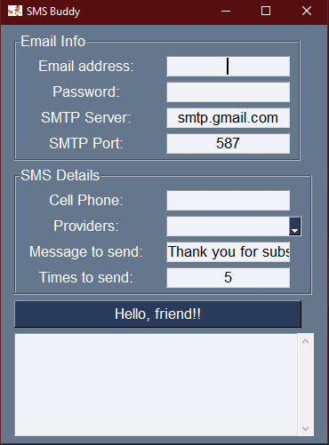

# SMS-Buddy
 
## Summary
For when just texting someone isn't enough.  I'm sure we've all had the pain of wanting to get some crucial notification, but you're also a procrastinator and can be likely to ignore a single text.  Right?  No?  Just me? Okay...anyway. 

I wrote this while trying to figure out how to efficiently send a text bomb to myself.  I enjoy homelabbing and have some things I want to know immediately if they go down.  I have a Telegram notification system, but figured I'd add SMS to the capabilities of any bot I was setting up.  

While testing this out, I set up a basic GUI to allow for texts to be sent easily from a gmail to various cell phone providers.  

# DISCLAIMER
Please don't use this for nefarious purposes.

However, if this is in fact used for nefarious purposes, all the recieving cell phone needs to do is block the number.
